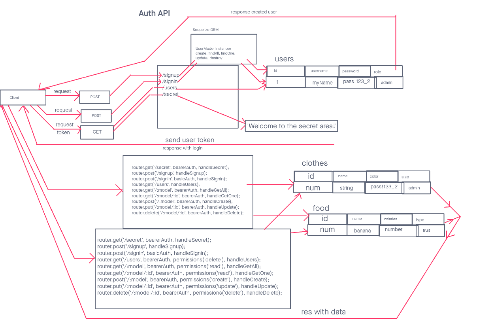

# LAB - 401-D49 Lab-08

## Project: auth-api

### Author: Lewis Benson

### Problem Domain

In this final phase, the new requirement is to extend the restrictive capabilities of our routes to our API, implementing a fully functional, authenticated and authorized API Server using the latest coding techniques

### Links and Resources

- [ci/cd]() (GitHub Actions)
- [server-prod]()

### Setup

#### `.env` requirements (where applicable)

see `.env.sample`

#### How to initialize/run your application (where applicable)

- nodemon

#### Features / Routes

- Feature one: Deploy to Prod

- GET : `/` - specific route to hit

- `/signin` : POST - login as user
- `/signup` : POST - create one user
- `/users` : GET - Read all usernames

#### Tests

- How do you run tests?
  - npm test
- Any tests of note?
  - handles root path
  - handles invalid paths
  - handles every CRUD function
- Describe any tests that you did not complete, skipped, etc

#### UML

Link to an image of the UML for your application and response to events
